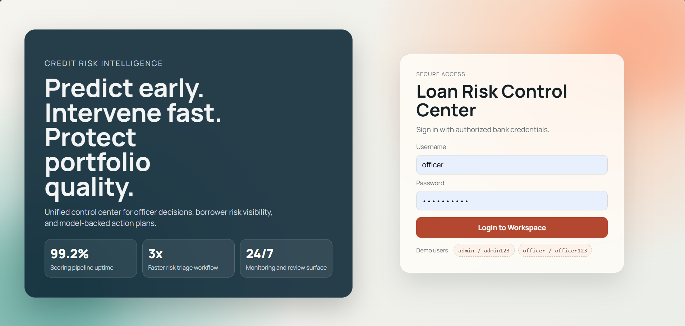

# Loan Risk Control Center

AI-powered loan risk monitoring platform with a FastAPI backend, ML risk scoring pipeline, and a React dashboard for officers/admins.



## Live Application

- Frontend (Vercel): https://loan-risk-system.vercel.app
- Backend (Railway): https://loan-risk-system-production.up.railway.app
- API Docs: https://loan-risk-system-production.up.railway.app/docs

## Demo Login Credentials

- `admin` / `admin123`
- `officer` / `officer123`

## What This Project Does

- Predicts borrower risk (`HIGH`, `MEDIUM`, `LOW`) using a trained ML model.
- Recommends operational action (`ESCALATE_TO_OFFICER`, `MONITOR`, `CONTINUE_NORMAL`).
- Provides role-based dashboard access (`ADMIN`, `OFFICER`).
- Shows analytics charts, top risky borrowers, officer review queue, and borrower risk history.
- Stores prediction history in SQLite for auditability.

## Tech Stack

- Backend: FastAPI, SQLAlchemy, JWT auth, scikit-learn, pandas, numpy
- Frontend: React + Vite, React Router, Recharts
- Database: SQLite (`loan_risk.db`)
- Testing: pytest + FastAPI TestClient

## Project Structure

```text
loan-risk-system/
  api/                # FastAPI server, auth, database models
  ml/                 # Model training artifacts and scoring code
  frontend/           # React dashboard
  data/               # Generated/raw loan datasets
  features/           # Feature/risk labeling scripts
  tests/              # Backend regression tests
```

## Run On Your Laptop

### 1. Prerequisites

- Python 3.10+ (recommended 3.11)
- Node.js 18+ and npm
- Git

### 2. Clone Repository

```bash
git clone https://github.com/AlexZx-05/loan-risk-system.git
cd loan-risk-system
```

### 3. Backend Setup (FastAPI)

```bash
python -m venv .venv
# Windows:
.venv\Scripts\activate
# macOS/Linux:
# source .venv/bin/activate

pip install -r requirements.txt
python -m uvicorn api.fastapi_server:app --host 127.0.0.1 --port 8000
```

Backend docs: `http://127.0.0.1:8000/docs`

### 4. Frontend Setup (React)

Open a new terminal in project root:

```bash
cd frontend
npm install
npm run dev -- --host 127.0.0.1 --port 5173
```

Frontend URL: `http://127.0.0.1:5173`

## Key API Endpoints

- `POST /login` - Authenticate and return JWT token
- `POST /predict` - Predict single borrower risk
- `GET /analytics` - Portfolio risk analytics (role-protected)
- `GET /top_risky` - Top high-risk borrowers (role-protected)
- `GET /need_officer` - Borrowers needing manual review (role-protected)
- `GET /risk_history/{borrower_id}` - Borrower history + model snapshot fallback

## Run Tests

```bash
python -m pytest -q
```

## Notes

- Frontend API base URL uses local backend in dev (`http://127.0.0.1:8000`).
- SQLite DB file is local and should not be committed.

## Author

Deepak Sharma
